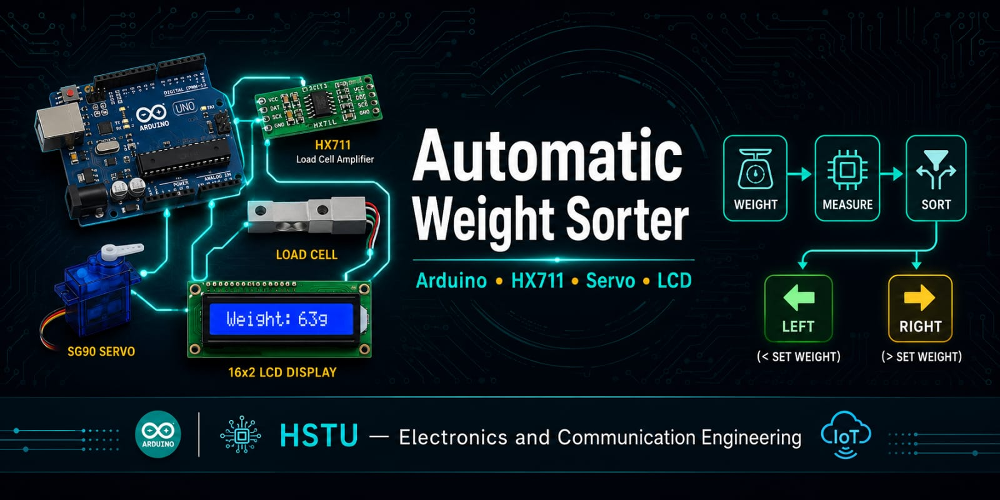
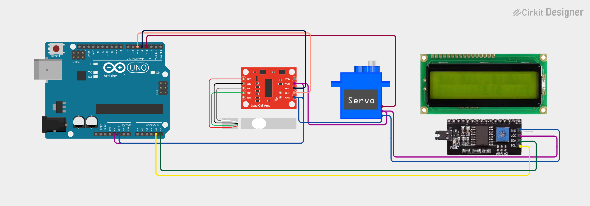

<div align="center">



</div>

# Automatic Weight Sorter

An Arduino-based **automatic weight sorter** that measures an object's weight using a **load cell (HX711)**, displays it on a **16x2 LCD**, and sorts the object into **LEFT** (light) or **RIGHT** (heavy) bins using a **servo motor**.

---

## Table of Contents

- [Demo](#demo)
- [Features](#features)
- [Hardware Components](#hardware-components)
- [Pin Connections](#pin-connections)
- [Circuit Diagram](#circuit-diagram)
- [Setup & Installation](#setup--installation)
- [How It Works](#how-it-works)
- [Calibration](#calibration)
- [Usage](#usage)
- [Code Configuration](#code-configuration)
- [Troubleshooting](#troubleshooting)
- [License](#license)

---

## Demo

<div align="center">



</div>

<div align="center">


</div>

---

## Features

- **Precise Weight Measurement** — HX711 load cell amplifier with configurable calibration factor
- **Automatic Sorting** — Servo-driven gate diverts objects based on a weight threshold (default 300g)
- **LCD Display** — Real-time weight, stability progress bar, and sorting status on a 16x2 I2C LCD
- **Stability Detection** — Object must remain stable for 6 consecutive readings before sorting
- **Offset Correction** — Displays weight with a -7g correction for accurate readings
- **Tare Function** — Push button resets the scale to zero
- **Serial Debugging** — Live weight, stability count, and sort events printed to Serial Monitor
- **Configurable Delays** — Adjustable wait time before sorting and before returning servo to center

---

## Hardware Components

| Component            | Quantity |
|----------------------|----------|
| Arduino Uno (or Nano)| 1        |
| HX711 Load Cell Amplifier | 1    |
| 5kg Load Cell (4-wire)| 1       |
| Servo Motor (MG90S)  | 1        |
| 16x2 LCD (I2C)       | 1        |
| Tactile Push Button  | 1        |
| Breadboard & Jumper Wires | -   |
| 5V Power Supply / USB| 1        |

---

## Pin Connections

| Component        | Arduino Pin |
|------------------|-------------|
| HX711 DT         | D5          |
| HX711 SCK        | D4          |
| Tare Button      | D6 (other leg → GND) |
| Servo Signal     | D3          |
| LCD SDA          | A4          |
| LCD SCL          | A5          |

---

## Circuit Diagram

<div align="center">


</div>

---

## Setup & Installation

1. **Install Arduino IDE** (or use the Arduino CLI).
2. **Connect the Arduino** to your computer via USB.
3. **Install required libraries** via Arduino IDE Library Manager:
   - `HX711_ADC` by Ola Hadis
   - `LiquidCrystal_I2C`
   - `Servo` (built-in with Arduino IDE)
4. **Open** `code.ino` in the Arduino IDE:
   ```
   File → Open → code.ino
   ```
5. **Select your board & port**:
   ```
   Tools → Board → Arduino AVR Boards → Arduino Uno
   Tools → Port → (your Arduino's COM port)
   ```
6. **Upload** the code:
   ```
   Sketch → Upload   (or Ctrl+U)
   ```

---

## How It Works

```
┌─────────────────────────────────────────────┐
│  1. User places object on the load cell      │
│  2. HX711 reads raw weight, sends to Arduino│
│  3. Arduino checks stability (6 readings)   │
│  4. After 8s wait, servo sorts:             │
│     - Weight >= 300g → Servo RIGHT (150)    │
│     - Weight <  300g → Servo LEFT  (60)     │
│  5. After object is removed, servo returns  │
│     to CENTER (109) after 8s delay          │
│  6. Cycle repeats                          │
└─────────────────────────────────────────────┘
```

### Thresholds

| Parameter          | Value   | Description                                  |
|--------------------|---------|----------------------------------------------|
| THRESHOLD          | 300.0g  | Weight threshold for LEFT vs RIGHT sorting   |
| MIN_WEIGHT         | 10.0g   | Minimum weight to start stability detection  |
| STABLE_COUNT       | 6       | Consecutive stable readings required         |
| STABLE_TOL         | 8.0g    | Max variation between readings to be stable  |
| WEIGHT_OFFSET      | 7.0g    | Displayed weight is reduced by this amount   |
| DELAY_BEFORE_SORT  | 8000ms  | Wait time after stable weight before sorting |
| DELAY_BEFORE_RETURN| 8000ms  | Wait time after removal before returning     |

---

## Calibration

1. Open the **Serial Monitor** (`Ctrl+Shift+M`) at **9600 baud**.
2. Press the **Tare button** — the scale resets to zero.
3. Place a known weight on the load cell.
4. Adjust `LoadCell.setCalFactor(375)` in `setup()` until the displayed weight matches the known weight.
5. Re-upload the code.

---

## Usage

1. Power up the Arduino — the LCD shows "Weight Sorter" and "HSTU 2026".
2. The servo starts at **center** (109°).
3. Place an object on the load cell.
4. The LCD shows a progress bar `[##   ]` tracking stability.
5. Once stable, after the 8-second delay, the servo sorts the object:
   - **≥ 300g** → Servo moves **RIGHT** (150°)
   - **< 300g** → Servo moves **LEFT** (60°)
6. Remove the object — after 8 seconds, the servo returns to center.
7. Press the **Tare button** anytime to reset the scale.

---

## Code Configuration

Key constants are defined at the top of `code.ino` and can be adjusted:

```cpp
#define THRESHOLD           300.0    // Sort boundary weight in grams
#define MIN_WEIGHT          10.0     // Min weight to start detection
#define STABLE_COUNT        6        // Readings needed for stability
#define STABLE_TOL          8.0      // Max delta between readings
#define WEIGHT_OFFSET       7.0      // Displayed weight correction
#define DELAY_BEFORE_SORT   8000     // ms before sorting
#define DELAY_BEFORE_RETURN 8000     // ms before returning to center

Servo angles:
#define SERVO_CENTER   109
#define SERVO_RIGHT    150
#define SERVO_LEFT     60

CalFactor: 375
```

---

## Troubleshooting

| Problem                          | Solution                                   |
|----------------------------------|--------------------------------------------|
| Weight reads 0 or negative       | Check HX711 wiring; re-tare; check load cell |
| Servo jittering                  | Ensure stable 5V power; add capacitor      |
| LCD shows blank blocks           | Adjust contrast pot; check I2C address     |
| Sorting triggers too early       | Increase STABLE_COUNT or STABLE_TOL        |
| Wrong sort direction             | Swap SERVO_LEFT / SERVO_RIGHT values       |
| LCD shows nothing                | Check SDA/A4, SCL/A5 connections           |

---

## License

This project is licensed under the **MIT License** — see the [LICENSE](LICENSE) file for details.

---

<div align="center">

Made with ❤️ by the team at HSTU · 2026

</div>
